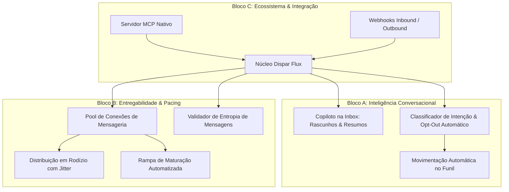
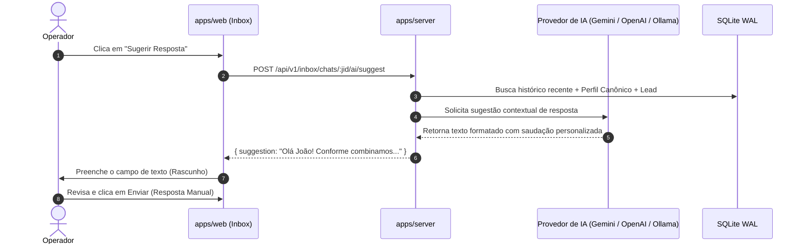
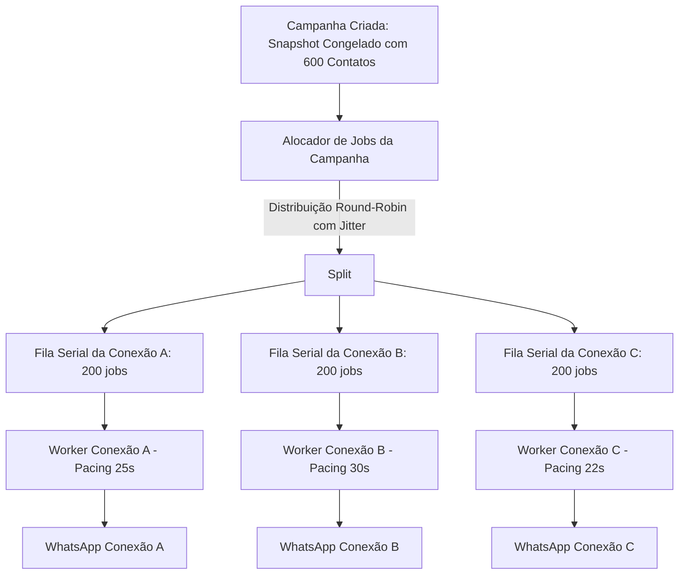
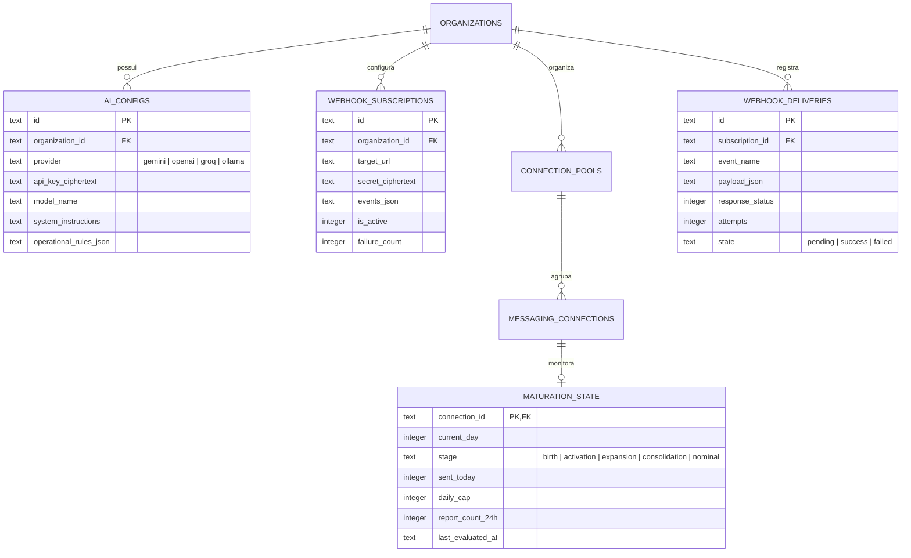

# Especificação Técnica: Inteligência Conversacional, Distribuição Multi-Conexão e Ecossistema

**Documento:** Especificação Técnica de Produto e Engenharia (Blocos A, B e C)  
**Data:** 2026-09-14  
**Status:** Proposto / Em Especificação  
**Alinhamento:** [`CONTEXT.md`](../CONTEXT.md), [`docs/plano-mestre-self-hosted-web.md`](./plano-mestre-self-hosted-web.md), [`docs/plano-fases-restantes-paridade-100-web.md`](./plano-fases-restantes-paridade-100-web.md) e ADRs 0005, 0024, 0027, 0028, 0035, 0038, 0039, 0040, 0044, 0060.

---

## 1. Visão Geral e Princípios

Esta especificação consolida a evolução estratégica do **Dispar Flux**, orientada pelas tendências e demandas de mercado de 2026 levantadas via pesquisa de ecossistema (`last30days`).

O mercado de mensageria ativa superou a era do disparo cego e isolado. A sustentabilidade e o valor do produto residem na **ativação conversacional qualificada**, na **entregabilidade com proteção de reputação** e na **interoperabilidade com agentes autônomos e automações externas**.

A especificação está estruturada em três blocos sinérgicos:

- **Bloco A: Inteligência e Qualificação de Leads**: Assistência de IA ao Operador na Inbox, classificação de intenções e automação de Opt-out e movimentação de Leads no Funil.
- **Bloco B: Motor de Campanhas e Entregabilidade**: Distribuição de carga em rodízio multi-conexão, maturação gradual automatizada e análise de entropia de mensagens.
- **Bloco C: Conectividade e Ecossistema**: Servidor MCP nativo para orquestração por modelos de linguagem externos e motor bidirecional de Webhooks seguro.



---

## 2. Governança Terminológica (Linguagem Ubíqua)

Toda a implementação técnica dos Blocos A, B e C respeita estritamente os termos definidos em [`CONTEXT.md`](../CONTEXT.md):

| Termo Canônico | Significado no Contexto dos Blocos | Termo Proibido (Evitar) |
|---|---|---|
| **Conexão de Mensageria** | Vínculo autenticado do Baileys pertencente a uma Organização | Chip, instância, sessão, motor |
| **Campanha** | Envio Automatizado com snapshot congelado distribuído entre Conexões | Disparo, blast, broadcast em massa |
| **Piso de Segurança** | Conjunto obrigatório de pacing (mín. 15s) e tetos diários intransponíveis | Anti-ban, configuração padrão |
| **Funil / Lead** | Sequência ordenada de etapas comerciais e o registro do Contato nela | Kanban / Cartão |
| **Conversa** | Linha temporal de mensagens entre um Contato e uma Conexão | Chat, conversa isolada, JID |
| **Opt-out** | Bloqueio organizacional irrestrito a novos Envios Automatizados | Descadastro da lista, blacklist |
| **Supressão Pseudonimizada**| Registro hash que impede reenvios mesmo se o Contato for excluído | Telefone bloqueado, contato anonimizado |
| **Conta de Serviço** | Identidade não humana para autenticação de Webhooks e MCP | API key global, usuário bot |

---

## 3. Bloco A: Inteligência e Qualificação de Leads

### 3.1. Copiloto do Operador na Inbox (AI Drafting & Summary)

#### 3.1.1. Objetivo
Aumentar a produtividade dos Operadores no atendimento, mantendo o controle humano antes do envio (*human-in-the-loop*). A IA atua como assistente: sugere respostas contextuais e resume o histórico de negociações para a equipe.

#### 3.1.2. Arquitetura e Fluxo de Dados
1. O Operador clica em "Sugerir Resposta" ou pressiona atalho `Ctrl+J` na Inbox.
2. O servidor compila o contexto:
   - Últimas 10 mensagens da Conversa.
   - Atributos do Perfil Canônico do Contato (nome, campos personalizados).
   - Dados do Lead (etapa atual do Funil, anotações prévias).
   - Diretrizes de tom de voz configuradas na Organização.
3. O serviço de IA (`packages/inbox/src/ai/copilot-service.ts`) invoca o provedor configurado (OpenAI, Gemini, Groq ou Ollama local).
4. A resposta gerada é inserida no campo de digitação do Operador em estado de rascunho, sem envio automático.



#### 3.1.3. Contratos de API
- `POST /api/v1/inbox/chats/:jid/ai/suggest`
  - **Payload:** `{ tone?: 'formal' | 'consultative' | 'direct', instruction?: string }`
  - **Resposta (200):** `{ suggestion: string, contextTokensUsed: number }`
- `POST /api/v1/inbox/chats/:jid/ai/summarize`
  - **Payload:** `{ saveAsLeadNote?: boolean }`
  - **Resposta (200):** `{ summary: string, keyPoints: string[], nextSteps: string[] }`
  - **Efeito colateral:** Se `saveAsLeadNote: true`, insere automaticamente o resumo nas anotações internas do Lead no Funil.

---

### 3.2. Classificador Automático de Sentimento e Intenção

#### 3.2.1. Objetivo
Detectar automaticamente se uma mensagem recebida de um Contato expressa pedido de parada (Opt-out), interesse de compra ou dúvida, aplicando ações de domínio sem intervenção humana lenta.

#### 3.2.2. Regras de Domínio e Ações
Ao receber uma nova mensagem pelo conector Baileys (`messages.upsert`):
1. **Verificação Rápida de Opt-Out (Regra Heurística + LLM):**
   - Expressões explícitas ("pare", "sair", "não me chame mais", "remover", "spam", "processo") acionam imediatamente o Opt-out organizacional (ADR 0040) e Supressão Pseudonimizada (ADR 0044).
   - O Contato é marcado com Opt-out, impedindo qualquer futuro Envio Automatizado por qualquer Conexão da Organização.
   - Um Registro de Auditoria é gravado com procedência `system:ai_intent_classifier`.
   - A Conversa exibe banner visual: *"Opt-out registrado automaticamente via inteligência de sentimento"*.
2. **Classificação de Intenção Comercial:**
   - Categorias: `INTERESTED` (Lead quente), `QUESTION` (Dúvida pontual), `SCHEDULING` (Pedido de reunião/agenda), `NOT_INTERESTED` (Desinteresse educado), `OTHER`.
   - Se a intenção for `INTERESTED`, o Lead associado no Funil comercial é movido automaticamente para a etapa configurada (ex.: "Interessados / Qualificados").
   - Emite evento WebSocket `crm:lead_stage_auto_transition` e notificação aos Operadores.

#### 3.2.3. Contrato do Classificador
```typescript
export interface IntentClassificationResult {
  sentiment: 'positive' | 'neutral' | 'negative' | 'hostile';
  intent: 'opt_out' | 'interested' | 'question' | 'scheduling' | 'not_interested' | 'unknown';
  confidence: number; // 0.00 a 1.00
  triggerPhrase?: string;
  recommendedAction: 'apply_opt_out' | 'move_to_stage' | 'notify_operator' | 'none';
  targetStageId?: string;
}
```

---

## 4. Bloco B: Motor de Campanhas e Entregabilidade

### 4.1. Distribuição em Rodízio Multi-Conexão (Multi-Connection Pool)

#### 4.1.1. Objetivo
Permitir que uma Campanha utilize múltiplas Conexões de Mensageria ativas da Organização, distribuindo o volume de forma equilibrada para preservar a reputação dos números e acelerar o tempo total sem violar o Piso de Segurança.

#### 4.1.2. Arquitetura de Fila por Conexão (ADR 0027)
O Dispar Flux não unifica a fila física de envio; cada Conexão possui seu próprio worker serial isolado com seu próprio pacing (mínimo de 15 segundos - ADR 0060) e seu próprio teto diário:



#### 4.1.3. Tolerância a Falhas e Desconexão
- Se uma das Conexões de Mensageria sofrer desconexão (`connection.update` = `close`), o worker dessa conexão pausa seus jobs.
- O Alocador da Campanha detecta a inatividade após 3 minutos e oferece ao Proprietário a opção de:
  1. Aguardar a reconexão automática com backoff exponencial.
  2. Rebalancear os jobs pendentes da conexão caída para as demais conexões ativas do pool.
- Jobs em trânsito no momento da queda são marcados como **Envio Incerto** (ADR 0028) e nunca repetidos automaticamente.

---

### 4.2. Modo Warm-up Gradual Automatizado (Rampa de Maturação)

#### 4.2.1. Objetivo
Automatizar a governança de novas Conexões de Mensageria (números recém-pareados), aplicando limites rígidos e escalonamento programado sem depender de disciplina manual do operador.

#### 4.2.2. Protocolo de Escalonamento (21 Dias)
Cada Conexão possui um registro de ciclo de vida:

| Fase de Maturação | Período | Teto Diário Automático | Pacing Mínimo Forçado | Tipos de Envio Permitidos |
|---|---|---|---|---|
| **Fase 1: Nascimento** | Dias 1 a 3 | 0 msgs automatizadas | - | Apenas Resposta Manual do Operador na Inbox |
| **Fase 2: Ativação** | Dias 4 a 7 | Máximo 25 msgs/dia | Mínimo 45 segundos | Campanhas pequenas para contatos com histórico |
| **Fase 3: Expansão** | Dias 8 a 14 | Máximo 60 msgs/dia | Mínimo 30 segundos | Campanhas com modo Spintax ou IA obrigatório |
| **Fase 4: Consolidação**| Dias 15 a 21 | Máximo 120 msgs/dia | Mínimo 20 segundos | Campanhas normais com monitoramento de denúncias |
| **Fase 5: Nominal** | Após Dia 21 | Teto nominal da Org. | Mínimo 15 segundos (Piso) | Operação completa desbloqueada |

#### 4.2.3. Travas de Segurança Ativas
- **Trava de Denúncia Imediata:** Se uma Conexão em maturação receber 2 bloqueios/denúncias em menos de 24 horas, o sistema bloqueia automaticamente novos Envios Automatizados daquela conexão e emite alerta crítico ao Proprietário.
- **Transparência Visual:** Na tela de Conexões e na tela de Disparo, o card da Conexão exibe uma insígnia *"Em Maturação: Dia 6 de 21"* com a cota restante do dia.

---

### 4.3. Validador e Simulador de Entropia de Mensagens

#### 4.3.1. Objetivo
Garantir que mensagens disparadas em Campanhas possuam variedade léxica suficiente para não serem detectadas por filtros de rede como rajada idêntica de spam.

#### 4.3.2. Métricas de Avaliação
Antes de liberar o início de uma Campanha, o endpoint `POST /api/v1/campaigns/validate-entropy` calcula:
1. **Espaço Amostral Combinatório ($C$):** Total de variações exclusivas possíveis geradas pelas tags Spintax `{A|B|C}` e blocos de texto.
2. **Taxa de Cobertura ($R$):** Razão entre variações possíveis e o total de Contatos da Base:
   $$R = \frac{\text{Variações Possíveis}}{\text{Total de Contatos}}$$
3. **Índice de Entropia Semântica:** Estimativa de dispersão de vocabulário baseada nos n-grams gerados.

#### 4.3.3. Classificação de Risco
- **Risco Alto (Vermelho):** $R < 0.2$ (menos de 1 variação para cada 5 contatos). O sistema bloqueia o início até que o operador adicione variações Spintax ou ative o Modo IA.
- **Risco Moderado (Amarelo):** $0.2 \le R < 0.8$. O sistema exibe aviso recomendando enriquecimento de variáveis.
- **Risco Baixo (Verde):** $R \ge 0.8$ ou Modo IA ativo gerando mensagens únicas por destinatário.

---

## 5. Bloco C: Conectividade e Ecossistema

### 5.1. Servidor MCP Nativo (Model Context Protocol)

#### 5.1.1. Objetivo
Permitir que agentes autônomos locais (Claude Code, Antigravity, OpenClaw, Cursor ou scripts locais) interajam com a Instalação do Dispar Flux sob autenticação estrita, consultando conversas, leads e disparando ações comerciais.

#### 5.1.2. Protocolo e Transporte
- O servidor Fastify disponibiliza o transporte **SSE (Server-Sent Events) + HTTP Post** no endpoint `/api/v1/mcp/sse`.
- Autenticação via cabeçalho `Authorization: Bearer <service_account_token>` associado a uma **Conta de Serviço** (ADR 0024) com perfil de permissões explícito.

#### 5.1.3. Catálogo de Ferramentas MCP Expostas

| Nome da Ferramenta MCP | Descrição | Parâmetros de Entrada | Permissão Mínima |
|---|---|---|---|
| `df_list_funnel_leads` | Lista Leads de um Funil filtrados por etapa ou tempo de inatividade | `funnelId`, `stageId?`, `inactiveHours?`, `limit?` | `crm:read` |
| `df_get_lead_details` | Retorna o histórico de Conversa e perfil do Lead | `leadId` ou `phone` | `crm:read`, `inbox:read` |
| `df_move_lead_stage` | Move o Lead para outra etapa do Funil com justificativa | `leadId`, `targetStageId`, `internalNote?` | `crm:write` |
| `df_send_manual_message`| Envia uma Resposta Manual direta via Conexão específica | `phone`, `text`, `connectionId?` | `inbox:write` |
| `df_register_opt_out` | Registra Opt-out irrestrito para um Contato | `phone`, `reason` | `contacts:write` |
| `df_get_campaign_health`| Retorna o status ao vivo das Campanhas e Conexões | nenhum | `campaigns:read` |

---

### 5.2. Webhooks Bidirecionais (Inbound & Outbound Event Engine)

#### 5.2.1. Objetivo
Integrar o Dispar Flux a ferramentas de automação (n8n, Typebot, Zapier) e sistemas de gestão financeira/ERP (Bling, Tiny, Asaas, Stripe).

#### 5.2.2. Webhooks de Saída (Outbound)
- **Entrega Assíncrona:** Gerenciada por worker dedicado com fila SQLite e backoff exponencial (1m, 5m, 15m, 1h).
- **Assinatura Criptográfica:** Todo payload enviado inclui o cabeçalho:
  `X-DisparFlux-Signature: sha256=HMAC_HEX(payload, webhook_secret)`
- **Eventos Disponíveis:**
  - `lead.created`: Novo Lead adicionado ao Funil.
  - `lead.stage_changed`: Lead avançou ou retrocedeu de etapa.
  - `message.received`: Nova mensagem recebida de um Contato.
  - `campaign.completed`: Campanha finalizada com sumário de entregabilidade.
  - `opt_out.registered`: Contato solicitou descadastro/saída.

#### 5.2.3. Webhooks de Entrada (Inbound)
Endpoints protegidos por Conta de Serviço para recepção de gatilhos externos:
- `POST /api/v1/integrations/inbound/lead`: Cria ou atualiza Contato e insere no Funil imediatamente.
- `POST /api/v1/integrations/inbound/campaign-trigger`: Enfileira envio de mensagem transacional ou inicia campanha para contato individual, submetendo-se obrigatoriamente ao Piso de Segurança e conferência prévia de Opt-out.

---

## 6. Modelo de Dados e Persistência (Drizzle / SQLite)

Novas tabelas adicionadas ao schema do `packages/database`:



---

## 7. Estratégia de Implementação e Compatibilidade

Os blocos foram desenhados para encaixar perfeitamente no roadmap existente de paridade web ([`docs/plano-fases-restantes-paridade-100-web.md`](./plano-fases-restantes-paridade-100-web.md)):

1. **Fase 14 (Motor de Campanhas):** Recebe a extensão de **Multi-Conexão e Entropia** (Bloco B).
2. **Fase 15 (Inbox) e Fase 16 (CRM):** Recebem o **Copiloto AI e Classificador de Intenção** (Bloco A).
3. **Fase 17 (Follow-up Cron):** Incorpora a **Maturação Automatizada de Conexões** (Bloco B).
4. **Fase 18 (Configurações e Integração):** Recebe o **Servidor MCP e Webhooks** (Bloco C).

---

## 8. Critérios de Aceite e Segurança

- [ ] **Piso de Segurança Absoluto:** Nenhuma automação de IA, webhook ou pool multi-conexão pode burlar o pacing mínimo de 15 segundos (ADR 0060) nem o teto diário fixado.
- [ ] **Respeito Irrestrito a Opt-Out:** Se a IA ou um operador registrar Opt-out, qualquer tentativa posterior de Envio Automatizado pelo motor é sumariamente abortada antes de tocar a rede.
- [ ] **Auditabilidade:** Todas as classificações de sentimento, avanços de etapa do Lead e disparos de webhooks devem gerar entradas estruturadas na tabela de Registros de Auditoria.
- [ ] **Soberania Local:** Provedores de IA locais (Ollama) devem funcionar offline em redes isoladas sem vazamento de PII para provedores externos.
