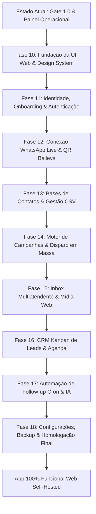

# Plano de Fases Restantes — Paridade Total Desktop para Web Self-Hosted

**Documento Canônico de Execução — Dispar Flux Web 1.0**  
**Data:** 2026-09-03  
**Status:** Aprovado para Execução  
**Referência:** [`docs/plano-mestre-self-hosted-web.md`](./plano-mestre-self-hosted-web.md), [`CONTEXT.md`](../CONTEXT.md) e ADRs 0001 a 0063.

---

## 1. Diagnóstico de Estado e Objetivo

### O que já foi concluído:
- **Fundação de Infraestrutura e Governança:** Workspace modular monólito com pacotes isolados (`domain`, `database`, `security`, `auth`, `campaigns`, `inbox`, `crm`, `connector-baileys`, `storage-local`, `migration`).
- **Persistência Segura:** SQLite com modo WAL nativo, travas de runtime exclusivo (*Installation Lock* ADR 0010), mitigação de duplicidade de processos e criptografia AES-256-GCM.
- **Testes de Gate 1.0:** 88 testes automatizados de backend aprovados cobrindo os 12 critérios de segurança, RBAC, opt-out e pacing floor.
- **Frontend Operacional Mínimo:** Uma SPA de validação que exibe apenas telemetria, health checks e métricas de conexão.

### O que falta para a Paridade Total com o Desktop:
O aplicativo legado em Electron possui **8 superfícies funcionais ricas** (`Inbox`, `Disparo`, `Kanban`, `Bases`, `Agenda`, `Cron`, `Configurações` e `Documentação`) que ainda não estão disponíveis para o usuário no navegador. Além disso, as rotas HTTP e eventos WebSocket do servidor precisam ser completamente expostos para atender a essas interfaces sem depender de IPC nativo (`window.api`).

Este documento estabelece as **Fases Restantes (Fase 10 à Fase 18)** para conduzir o projeto até a **paridade funcional de 100% com o aplicativo desktop**, operando nativamente no navegador em modelo *self-hosted*.



---

## 2. Mapa de Diferenças Arquiteturais: Desktop vs. Web

| Recurso | Como funcionava no Desktop (Electron) | Como funcionará na Web Self-Hosted |
|---|---|---|
| **Comunicação UI-Backend** | IPC direto via `window.api` (preload script). | Requisições HTTP REST tipadas (`fetch`) e canal WebSocket bidirecional resiliente. |
| **Sessão & Usuários** | Usuário único local sem login. | Equipe multi-operador com papéis (Proprietário, Administrador, Operador), cookies HttpOnly e CSRF tokens. |
| **Seleção de Arquivos** | Diálogos nativos do sistema operacional (`dialog.showOpenDialog`). | Drag & drop nativo HTML5, inputs de arquivo com validação no navegador e streaming seguro via REST. |
| **Exportação de Dados** | Gravação direta no disco pelo processo principal (`dialog.showSaveDialog`). | Download direto pelo navegador com `Content-Disposition: attachment` e geração de blobs sob demanda. |
| **Gravação de Áudio / PTT** | Captura local e transcodificação por utilitários no processo desktop. | Gravação via `navigator.mediaDevices` no navegador, upload em WebM/OGG e transcodificação Opus PTT no backend. |
| **Execução em Segundo Plano** | Dependia do app aberto na bandeja (tray) do Windows do usuário. | Daemon contínuo no servidor (VPS/Docker) rodando 24/7 de forma autônoma sem depender de aba aberta. |
| **Visualização de Mídia** | Protocolo customizado local `disparmedia://`. | URLs temporárias autorizadas (`/api/v1/inbox/media/:id`) com suporte a HTTP Range (206 Partial Content). |

---

## 3. Detalhamento das Fases Restantes

---

### 🎨 Fase 10: Fundação da UI Web & Design System Completo

**Objetivo:** Trazer a infraestrutura visual, roteamento e contratos de cliente do desktop para a aplicação web, recriando exatamente a experiência visual e a paleta de design do Dispar Flux.

#### 1. Escopo & Dependências no Frontend (`apps/web`):
- Instalar e configurar:
  - `tailwindcss` e `@tailwindcss/postcss` com suporte a variáveis CSS de tema.
  - `lucide-react` (mesma versão do desktop para compatibilidade de ícones).
  - `react-router-dom` v6 para roteamento de SPA.
  - `papaparse` para leitura e preview imediato de arquivos CSV no navegador.
- Migrar tokens visuais canônicos para `apps/web/src/index.css`:
  - Variáveis de superfície: `--surface-base`, `--surface-raised`, `--surface-sunken`.
  - Variáveis de linha e borda: `--border`, `--border-subtle`.
  - Variáveis de destaque e botões: `--accent`, `--accent-hover`, `--accent-wash`, `--btn`, `--btn-ink`.
  - Variáveis semânticas de estado: `--success`, `--warning`, `--danger` e suas variantes claras de contraste.
  - Sistema de temas dinâmico: suporte nativo a `[data-theme="dark"]` e `[data-theme="light"]`.

#### 2. Camada de Comunicação Web (`WebApiClient`):
- Criar a ponte cliente que substitui transparentemente o `window.api`:
  - `apps/web/src/services/api-client.ts`: funções tipadas para todas as chamadas HTTP da API REST com tratamento de erro, inclusão de CSRF tokens e retry automático.
  - `apps/web/src/hooks/useAppWebSocket.ts`: hook de WebSocket que escuta os canais do servidor (`whatsapp:state`, `inbox:changed`, `campaign:progress`, `crm:changed`, `contacts:validateProgress`) e distribui eventos via callbacks.

#### 3. Componentes Base do Design System:
- Portar e adaptar a biblioteca de componentes de interface (`apps/web/src/components/ui.tsx`):
  - `PageHeader`, `PageBody`, `StepSection`.
  - `Card`, `Button`, `IconButton`, `Input`, `Select`, `Toggle`.
  - `Table`, `Th`, `Td`, `Pill`, `StatusDot`, `Progress`, `EmptyState`, `Modal`, `Callout`.
- Portar e adaptar a barra lateral de navegação (`apps/web/src/components/Sidebar.tsx`):
  - Links de rotas ativas com contador de mensagens não lidas em tempo real.
  - Indicador de status de conexão do WhatsApp ao vivo.
  - Botão de alternância de tema Claro/Escuro persistido no `localStorage`.

#### 4. Critérios de Aceite (Gate da Fase 10):
- [x] O frontend compila sem erros TypeScript (`tsc --noEmit`) e inicializa via Vite.
- [x] Todas as rotas base (`/disparo`, `/inbox`, `/kanban`, `/agenda`, `/cron`, `/base`, `/config`, `/docs`) são navegáveis.
- [x] O tema claro e escuro alterna perfeitamente respeitando todas as variáveis de cor.
- [x] A barra lateral exibe a mesma identidade visual do aplicativo desktop.

---

### 🔐 Fase 11: Identidade, Onboarding & Autenticação Web

**Objetivo:** Oferecer a experiência de primeiro uso (*Claim*) e autenticação segura (*Login/Logout*) para múltiplos operadores numa instalação web self-hosted.

#### 1. Endpoints do Servidor (`apps/server`):
- `POST /api/v1/auth/claim`: Reivindicação inicial com código de instalação de uso único, configurando a Organização e o primeiro Proprietário.
- `POST /api/v1/auth/login`: Autenticação por e-mail e senha, criando sessão segura (cookie `df_session` com `HttpOnly; SameSite=Lax; Secure`).
- `POST /api/v1/auth/logout`: Revogação da sessão atual e limpeza de cookies.
- `GET /api/v1/auth/me`: Retorna os dados do membro logado, seu papel (`owner`, `admin`, `operator`) e status de autorização do dispositivo.
- `GET /api/v1/auth/devices`: Lista dispositivos registrados para aprovação pelo Proprietário.
- `POST /api/v1/auth/devices/:id/approve`: Aprovação de novo operador/navegador pelo Proprietário (ADR 0022).

#### 2. Telas no Frontend (`apps/web`):
- `ClaimPage.tsx`: Tela de primeiro acesso exibida quando a instalação ainda não foi reivindicada. Solicita o Token de Reivindicação (exibido nos logs de boot ou gerado via CLI), nome da Organização, nome do Proprietário, e-mail e senha forte.
- `LoginPage.tsx`: Formulário limpo e seguro de autenticação.
- `ProtectedRoute.tsx`: Componente de rota que verifica autenticação, redireciona operadores deslogados e exibe tela de "Aguardando aprovação do dispositivo" caso o dispositivo do operador ainda não tenha sido autorizado pelo Proprietário.

#### 3. Critérios de Aceite (Gate da Fase 11):
- [x] Tentativas de acesso sem login a rotas operacionais são redirecionadas para `/login`.
- [x] Quando a instalação for virgem, a aplicação redireciona automaticamente para `/claim`.
- [x] Sessões são persistidas via cookie `HttpOnly` com proteção CSRF ativa.
- [x] O comando CLI de recuperação de emergência (`bin/dispar-cli.js emergency-login`) continua operando diretamente no SQLite.

---

### 📱 Fase 12: Conexão WhatsApp Live & Pareamento Baileys

**Objetivo:** Permitir ao usuário parear o WhatsApp escaneando o QR Code diretamente no navegador e monitorar a saúde da conexão em tempo real com reconexão automática e armazenamento seguro de credenciais.

#### 1. Endpoints do Servidor (`apps/server`):
- `GET /api/v1/whatsapp/status`: Retorna o estado atual da conexão (`disconnected`, `connecting`, `qrcode`, `connected`, `failed`), telefone pareado, avatar e versão do WhatsApp Web.
- `POST /api/v1/whatsapp/connect`: Inicia o socket Baileys no servidor; gera o QR code caso não haja credenciais salvas.
- `POST /api/v1/whatsapp/disconnect`: Encerra o socket de conexão sem apagar as credenciais salvas.
- `POST /api/v1/whatsapp/logout`: Desconecta e expurga os arquivos da pasta `wa-auth` do servidor, permitindo novo pareamento do zero.
- `GET /api/v1/whatsapp/diagnostics`: Retorna métricas de ping, latência com os servidores do WhatsApp, tentativas de reconexão e eventos recentes.
- `GET/POST /api/v1/whatsapp/version-override`: Permite visualizar e sobrescrever a versão simulada do cliente WhatsApp Web para contornar rejeições de versão antiga pelo WhatsApp.

#### 2. Eventos WebSocket:
- `whatsapp:state`: Notifica em tempo real a mudança de estado (`connected`, `connecting`, etc.).
- `whatsapp:qr`: Transmite a string do QR Code atualizada e a contagem regressiva para expiração.

#### 3. Frontend (`apps/web`):
- Portar e adaptar `apps/web/src/components/WhatsappCard.tsx`:
  - Renderização do QR Code gerado em alta resolução no navegador via componente SVG/Canvas.
  - Temporizador visual de expiração do QR Code com atualização automática via WebSocket.
  - Painel de status com informações do número conectado, pushname, aviso de desconexão e botões de ação ("Conectar", "Desconectar", "Desconectar e Limpar Sessão").
  - Modal de diagnóstico e ajuste fino de versão do WhatsApp.
- Hook `useWhatsapp.ts`: expõe estado unificado em toda a aplicação e alimenta o status dot da `Sidebar`.

#### 4. Critérios de Aceite (Gate da Fase 12):
- [x] O usuário consegue escanear o QR Code exibido no navegador e parear o WhatsApp com sucesso.
- [x] O estado de conexão reflete imediatamente na barra lateral e em todas as telas sem necessidade de refresh manual.
- [x] Reiniciar o servidor Node preserva a sessão autenticada do WhatsApp (`wa-auth`) e reconecta automaticamente em menos de 10 segundos.
- [x] Encerramento ou queda temporária da internet aciona o backoff exponencial sem abrir sockets concorrentes duplicados.

---

### 📇 Fase 13: Gestão de Contatos, Bases e Importação/Exportação CSV

**Objetivo:** Gestão integral de listas de contatos (Bases), importação amigável de planilhas CSV com mapeamento flexível de colunas, validação de números no WhatsApp e download de relatórios.

#### 1. Endpoints do Servidor (`apps/server`):
- `GET /api/v1/bases`: Lista todas as Bases de contatos da Organização com contadores estatísticos consolidados (total, válidos, inválidos, não verificados, opt-outs).
- `POST /api/v1/bases`: Criação de uma nova Base de contatos com nome descritivo.
- `DELETE /api/v1/bases/:id`: Exclusão da Base e das participações de contatos associadas.
- `GET /api/v1/bases/:id/contacts`: Busca paginada de contatos da Base com suporte a filtros (`all`, `valid`, `invalid`, `unchecked`, `optOut`) e busca textual por nome ou telefone.
- `POST /api/v1/bases/:id/import`: Importação de lote de contatos com mapeamento de colunas (`name`, `phone`, `extraFields` arbitrários em JSON). Normalização automática de números brasileiros (regra do 9º dígito) e deduplicação inteligente.
- `GET /api/v1/bases/:id/export`: Exportação completa da Base em formato CSV formatado para download direto no navegador.
- `GET /api/v1/bases/template`: Download da planilha modelo CSV de exemplo.
- `POST /api/v1/contacts/:id/opt-out`: Registro ou cancelamento de opt-out (descadastro) do contato com trilha de auditoria.
- `POST /api/v1/bases/:id/validate`: Dispara o processo de validação em lote dos telefones no WhatsApp através do conector Baileys (`onWhatsApp`), emitindo progresso via WebSocket.

#### 2. Frontend (`apps/web`):
- Portar e adaptar `apps/web/src/pages/BasePage.tsx`:
  - Seletor de Bases com contadores de status em pílulas coloridas.
  - Tabela responsiva de contatos com paginação rápida, busca em tempo real e visualização de variáveis dinâmicas customizadas.
  - Ações rápidas por contato: alternar Opt-Out (com justificativa rastreável) e exclusão.
  - Botão de validação de telefones com barra de progresso em tempo real.
- Portar e adaptar `apps/web/src/components/CsvImportModal.tsx`:
  - Área de arrastar e soltar (drag & drop) para planilhas CSV.
  - Pré-visualização instantânea das primeiras 5 linhas do arquivo no navegador via PapaParse.
  - Interface intuitiva de mapeamento de colunas: associação das colunas da planilha aos campos `Nome`, `Telefone` e campos extras para personalização de mensagens.
  - Barra de progresso de upload e relatório de resumo ao finalizar (inseridos, atualizados, inválidos).

#### 3. Critérios de Aceite (Gate da Fase 13):
- [x] O operador consegue importar arquivos CSV de até 50.000 contatos com pré-visualização e mapeamento visual de colunas.
- [x] Números brasileiros são higienizados e normalizados conforme as regras canônicas do domínio.
- [x] A exportação de contatos gera o arquivo CSV e dispara o download imediatamente no navegador.
- [x] A validação no WhatsApp avança emitindo porcentagem em tempo real e marca contatos sem WhatsApp como inválidos.

---

### 🚀 Fase 14: Motor de Campanhas & Disparo em Massa

**Objetivo:** Criação, pré-visualização, agendamento e execução de disparos em massa com total segurança contra banimento, conformidade com o Piso de Segurança e operação 24/7 autônoma no servidor.

#### 1. Endpoints do Servidor (`apps/server`):
- `POST /api/v1/campaigns/plan`: Calcula o plano de envio prévio com base na Base escolhida, contatos elegíveis, modo de mensagem e estimativa de tempo total de disparo.
- `POST /api/v1/campaigns/start`: Cria e congela o *snapshot* da campanha, enfileira os jobs seriais no banco de dados e inicia o motor de envio em segundo plano.
- `POST /api/v1/campaigns/:id/pause`: Pausa a execução do envio respeitando o job atualmente em trânsito.
- `POST /api/v1/campaigns/:id/resume`: Retoma a campanha pausada a partir do ponto exato onde parou.
- `POST /api/v1/campaigns/:id/cancel`: Cancela os envios pendentes definitivamente.
- `GET /api/v1/campaigns/active`: Retorna a campanha atualmente em execução ou pausada, se houver.
- `GET /api/v1/campaigns/:id/progress`: Retorna métricas atualizadas de progresso (enviados, pendentes, falhas, tempo decorrido, previsão de término).
- `GET /api/v1/campaigns/:id/jobs`: Lista paginada dos destinatários e status individual de cada envio (`pending`, `sending`, `sent`, `delivered`, `read`, `failed`, `unknown`).
- `GET/POST /api/v1/campaigns/draft`: Recupera ou salva rascunho de configuração de campanha para evitar perda de dados se o operador fechar a aba.

#### 2. Eventos WebSocket:
- `campaign:progress`: Transmite eventos a cada mensagem disparada (destinatário, tempo de espera para a próxima mensagem, contagem de sucessos/falhas).
- `campaign:stopped`: Notifica a conclusão, pausa forçada por limite diário atingido ou cancelamento da campanha.

#### 3. Frontend (`apps/web`):
- Portar e adaptar `apps/web/src/pages/DisparoPage.tsx`:
  - **Passo 1: Seleção da Base:** Escolha da lista com estatísticas de contatos elegíveis e opção de pular contatos que já receberam disparos anteriores.
  - **Passo 2: Modo de Mensagem:**
    - Modo Fixo: texto único com interpolação de variáveis `{{nome}}`, `{{telefone}}` e variáveis customizadas.
    - Modo Alternado: múltiplos textos completos em rodízio.
    - Modo Parágrafo: blocos de introdução, corpo e encerramento combinados dinamicamente.
    - Modo Spintax: variações sintáticas inline no formato `{Olá|Oi|Bom dia}`.
    - Modo IA: integração com LLM para gerar variações semânticas únicas por destinatário.
    - Calculadora em tempo real do número total de combinações possíveis.
  - **Passo 3: Mídia Anexa:** Upload opcional de anexo (imagem, documento ou áudio) que acompanhará o disparo.
  - **Passo 4: Parâmetros de Pacing & Segurança:** Configuração do intervalo entre envios (com garantia visual do piso mínimo de 15 segundos - ADR 0060), teto diário de mensagens e checklist de confirmação de responsabilidade operacional.
  - **Passo 5: Painel de Controle ao Vivo:**
    - Botões de comando: Iniciar Disparo, Pausar, Retomar, Cancelar.
    - Barra de progresso dinâmica em tempo real.
    - Tabela de jobs com paginação e filtro por status de entrega.

#### 4. Critérios de Aceite (Gate da Fase 14):
- [x] O envio da campanha continua ocorrendo normalmente no backend mesmo se o operador desligar o computador ou fechar o navegador.
- [x] O intervalo de envio (pacing) e os limites diários respeitam estritamente as travas de segurança sem permitir valores perigosos.
- [x] Contatos marcados com Opt-Out são rigorosamente bloqueados antes de qualquer tentativa de envio.
- [x] Em caso de queda do servidor ou do processo Node durante um envio, o job em trânsito é marcado como `unknown` (ADR 0028) e nunca é reenviado automaticamente na reinicialização.

---

### 💬 Fase 15: Inbox Multiatendente & Mídia Web

**Objetivo:** Central unificada de atendimento em tempo real via WhatsApp, permitindo múltiplos atendentes conversarem, trocarem mídias, ouvirem e enviarem notas de voz nativas diretamente pelo navegador.

#### 1. Endpoints do Servidor (`apps/server`):
- `GET /api/v1/inbox/chats`: Lista de conversas ordenadas pela mensagem mais recente, com paginação infinita, suporte a busca e contadores de mensagens não lidas.
- `GET /api/v1/inbox/chats/:jid`: Metadados completos do chat (nome, telefone, avatar, tags de lead e status de opt-out).
- `GET /api/v1/inbox/chats/:jid/messages`: Histórico paginado de mensagens do chat (com carregamento sob demanda ao rolar para cima).
- `POST /api/v1/inbox/chats/:jid/messages`: Envio de mensagem de texto avulsa pelo operador.
- `POST /api/v1/inbox/chats/:jid/media`: Envio de arquivo de mídia (imagem, vídeo ou documento) com suporte a legenda.
- `POST /api/v1/inbox/chats/:jid/voice`: Envio de nota de voz (gravação de microfone) empacotada no formato de áudio PTT (*Push-To-Talk*) compatível com o aplicativo do WhatsApp.
- `POST /api/v1/inbox/chats/:jid/read`: Marca a conversa como lida e notifica o WhatsApp e demais operadores conectados.
- `GET /api/v1/inbox/media/:id`: Rota de streaming de mídia autenticada com suporte a cabeçalhos `Range` para reprodução fluida de áudio e vídeo no navegador sem download completo prévio.
- `POST /api/v1/inbox/sync`: Dispara sincronização sob demanda do histórico antigo de conversas e detecção de respostas de leads.

#### 2. Eventos WebSocket:
- `inbox:changed`: Notifica novas mensagens recebidas ou enviadas, atualização de status de entrega (tiques cinzas, tiques duplos e tiques azuis) e alterações no contador geral de não lidas.

#### 3. Frontend (`apps/web`):
- Portar e adaptar `apps/web/src/pages/InboxPage.tsx`:
  - **Coluna da Esquerda (Lista de Chats):**
    - Avatares dinâmicos, nome do contato, trecho da última mensagem e horário formatado.
    - Badges de mensagens não lidas e indicadores visuais de leads do CRM.
    - Filtros rápidos: "Todas", "Não Lidas" e "Apenas Leads".
  - **Coluna da Direita (Área de Atendimento):**
    - Cabeçalho do contato com telefone formatado e atalho para registrar Opt-Out.
    - Linha do tempo de mensagens com balões estilizados (`MessageBubble.tsx`), suporte a quebras de linha e carimbos de data/hora.
    - Tiques visuais de entrega e confirmação de leitura sincronizados com o WhatsApp.
    - Visualizador de mídias: prévia de fotos, reprodutor embutido de vídeo e player de áudio com barra de progresso.
    - Componente de gravação de áudio com microfone (`useVoiceRecorder` adaptado para a Web Audio API nativa): contador de segundos em tempo real, cancelamento com um clique e envio direto como áudio PTT.
    - Seletor de emojis integrado (`EmojiPicker.tsx`).
    - Anexo de arquivos (imagens, documentos e áudios) via botão ou arrastando diretamente para a janela de chat.
    - Envio ao pressionar `Enter` e quebra de linha com `Shift + Enter`.

#### 4. Critérios de Aceite (Gate da Fase 15):
- [x] Novas mensagens enviadas por clientes aparecem instantaneamente na tela de todos os operadores logados via WebSocket.
- [x] O operador consegue gravar um áudio pelo microfone do navegador e enviá-lo como nota de voz oficial (com onda verde no WhatsApp do cliente).
- [x] Arquivos de áudio e vídeo são reproduzidos imediatamente sem travamento através de requisições parciais HTTP 206.
- [x] Abertura e rolagem de conversas longas utilizam paginação suave sem degradação de performance na DOM.

---

### 📊 Fase 16: CRM Kanban de Leads & Agenda de Compromissos

**Objetivo:** Gestão comercial integrada do funil de vendas, movendo leads automaticamente quando os clientes respondem e organizando reuniões e retornos na agenda unificada.

#### 1. Endpoints do Servidor (`apps/server`):
- `GET /api/v1/crm/board`: Retorna a estrutura completa do funil (todas as etapas/colunas e os leads ativos em cada uma).
- `POST /api/v1/crm/stages`: Criação de uma nova etapa no funil Kanban.
- `PATCH /api/v1/crm/stages/:id`: Renomeação ou reordenação de etapas.
- `DELETE /api/v1/crm/stages/:id`: Remoção de etapa com migração automática dos leads para outra coluna especificada.
- `PATCH /api/v1/crm/leads/:id/stage`: Mudança manual de coluna de um lead (arrastar e soltar).
- `PATCH /api/v1/crm/leads/:id/notes`: Atualização de anotações internas da negociação.
- `DELETE /api/v1/crm/leads/:id`: Remoção do lead do funil.
- `GET /api/v1/agenda`: Listagem de compromissos marcados e follow-ups agendados para determinado período de datas.
- `POST /api/v1/agenda`: Criação de novo compromisso vinculado a um contato/lead com data, horário e notas.
- `PATCH /api/v1/agenda/:id`: Atualização de compromisso ou alternância do status de concluído (`done`).
- `DELETE /api/v1/agenda/:id`: Exclusão de compromisso da agenda.

#### 2. Eventos WebSocket:
- `crm:changed`: Emite atualização quando um lead avança de fase, garantindo que o quadro Kanban permaneça sincronizado para toda a equipe em tempo real.

#### 3. Frontend (`apps/web`):
- Portar e adaptar `apps/web/src/pages/KanbanPage.tsx`:
  - Quadro de colunas estilizado com suporte a arrastar e soltar (Drag & Drop) nativo na web.
  - **Avanço Automático de Leads:** Contatos disparados entram na primeira coluna ("Aguardando resposta") e avançam sozinhos para a coluna "Em andamento" no instante em que o cliente responde no WhatsApp.
  - Cartões de Lead com tempo decorrido desde o primeiro envio e da última resposta, telefone formatado e indicador de anotações.
  - Gaveta/Modal de detalhes do lead para registro de anotações, histórico e atalho direto para abrir o chat na Inbox.
  - Modal de gerenciamento de colunas do funil (adicionar, renomear, reordenar e excluir).
- Portar e adaptar `apps/web/src/pages/AgendaPage.tsx`:
  - Grade de calendário mensal com navegação intuitiva entre meses.
  - Visualização unificada por dia de reuniões manuais e envios programados de follow-up.
  - Modal para agendar novos compromissos rápidos e caixa de seleção para marcar compromissos finalizados.

#### 4. Critérios de Aceite (Gate da Fase 16):
- [x] Quando um cliente responde a um disparo no WhatsApp, seu cartão de lead é criado ou movido automaticamente para a etapa de resposta no Kanban.
- [x] Operadores conseguem arrastar cartões entre colunas suavemente em telas desktop e notebooks.
- [x] A agenda reflete com precisão os horários considerando o Fuso Horário Operacional da Organização (`operationalTimezone`).

---

### ⏰ Fase 17: Automação de Follow-up (Cron) & Variações por IA

**Objetivo:** Regras automatizadas de reengajamento para contatar clientes que não responderam após X horas, e geração de textos personalizados usando modelos de Inteligência Artificial.

#### 1. Endpoints do Servidor (`apps/server`):
- `GET /api/v1/followups`: Lista todas as regras de follow-up automatizadas configuradas.
- `POST /api/v1/followups`: Criação de regra com parâmetros:
  - Horas de silêncio exigidas (ex.: aguardar 24h ou 48h sem resposta do cliente).
  - Dias da semana permitidos (ex.: segunda a sexta).
  - Janela de horário operacional (ex.: 09:00 às 18:00 no fuso da instalação).
  - Quantidade máxima de tentativas por contato (ex.: até 2 follow-ups).
  - Mensagem (fixa, alternada, spintax ou IA).
- `PATCH /api/v1/followups/:id`: Edição dos parâmetros da regra ou chave de ativação (`enabled: true/false`).
- `DELETE /api/v1/followups/:id`: Exclusão da regra.
- `GET /api/v1/followups/:id/preview`: Simulação em tempo real que lista quantos e quais contatos estão elegíveis para receber a mensagem naquele momento.
- `POST /api/v1/followups/:id/run`: Disparo manual imediato para a fila de execução.
- `POST /api/v1/ai/generate-variants`: Gera variações de texto a partir de um prompt base utilizando o provedor de IA configurado.

#### 2. Frontend (`apps/web`):
- Portar e adaptar `apps/web/src/pages/CronPage.tsx`:
  - Lista de regras ativas com chaves seletoras (toggles) liga/desliga.
  - Formulário completo de configuração de regra com seletores de dias da semana, horários de início e término e limite de tentativas.
  - Painel de pré-visualização de contatos que serão impactados antes de ativar a automação.
  - Botão de execução manual de teste ("Disparar Agora").
- Componente de geração e teste de IA integrado nas telas de Disparo e Cron.

#### 3. Critérios de Aceite (Gate da Fase 17):
- [x] O agendador de follow-up executa continuamente no servidor em segundo plano de acordo com o fuso horário configurado, mesmo sem operadores conectados.
- [x] Clientes que responderam ou solicitaram Opt-Out são estritamente excluídos do envio de follow-up.
- [x] A geração de variações por IA respeita os provedores suportados (Google Gemini, OpenAI, Groq e instâncias locais do Ollama).

---

### ⚙️ Fase 18: Configurações Globais, Backup & Homologação Final

**Objetivo:** Fechamento completo do sistema com gerenciamento de parâmetros, auditoria, criação e download de backups criptografados, central de ajuda e garantia de 100% de paridade funcional.

#### 1. Endpoints do Servidor (`apps/server`):
- `GET/PATCH /api/v1/settings/sending-defaults`: Parâmetros padrão de intervalo de pacing, jitter aleatório e limites diários.
- `GET/PATCH /api/v1/settings/ai`: Configuração segura do provedor de IA ativo (Gemini, OpenAI, Groq, Ollama), modelo e chave de API (criptografada no banco).
- `GET/PATCH /api/v1/settings/organization`: Nome da organização, fuso horário operacional e política de retenção de mensagens e mídias.
- `POST /api/v1/backup/create`: Criação do backup completo da instalação (SQLite WAL, mídias e credenciais), criptografado com a Chave de Recuperação da Instalação (ADR 0046).
- `GET /api/v1/backup/download`: Download direto do arquivo `.dfbackup`.
- `POST /api/v1/backup/restore`: Restauração assistida a partir de um arquivo de backup carregado pelo usuário.

#### 2. Frontend (`apps/web`):
- Portar e adaptar `apps/web/src/pages/ConfigPage.tsx`:
  - Seção WhatsApp: controle da sessão, versão forçada e status.
  - Seção de Envio: configuração dos limites de segurança e cadência padrão.
  - Seção de Inteligência Artificial: seletor de provedor, campo de chave de API com máscara e teste de conexão.
  - Seção de Equipe & Segurança: listagem de membros, aprovação de novos navegadores/dispositivos e emissão de convites.
  - Seção de Backup & Desastre: botão para gerar e baixar backup seguro e assistente de restauração.
- Portar e adaptar `apps/web/src/pages/DocsPage.tsx`:
  - Central de documentação interna com barra de pesquisa textual rápida.
  - Renderizador Markdown com formatação de código, alertas de atenção e tabelas de consulta sobre boas práticas e regras anti-banimento.

#### 3. Critérios de Aceite (Gate da Fase 18 — Aceite Final 1.0):
- [x] Todas as 8 páginas originais do aplicativo desktop funcionam de ponta a ponta no navegador.
- [x] O fluxo de trabalho de um operador (login -> conectar WhatsApp -> subir CSV -> disparar campanha -> atender respostas no Inbox -> mover leads no Kanban -> agendar reunião) é executado com zero dependência de recursos locais do desktop.
- [x] O backup do sistema é baixado via navegador e restaurado com 100% de integridade em uma instalação limpa.
- [x] O comando de inicialização unificado (`npm run dev` ou container Docker) sobe a aplicação pronta para uso em servidores de produção.

---

## 4. Matriz de Rastreabilidade e Cronograma de Entrega

```
Fase 10 (UI Web & Design System)       ──────┐
Fase 11 (Identidade & Login)           ──────┼──> Bloco 1: Fundação Visual e Acesso
                                             │
Fase 12 (WhatsApp Live & Baileys)      ──────┼──> Bloco 2: Conexão e Mensageria
Fase 13 (Contatos & CSV)               ──────┤
                                             │
Fase 14 (Motor de Campanhas)           ──────┼──> Bloco 3: Disparo e Atendimento
Fase 15 (Inbox Multiatendente)         ──────┤
                                             │
Fase 16 (CRM Kanban & Agenda)          ──────┼──> Bloco 4: Relacionamento e Automação
Fase 17 (Follow-up Cron & IA)          ──────┤
                                             │
Fase 18 (Configurações, Backup & 1.0)  ──────┴──> Bloco 5: Entrega da Versão 1.0
```

---

## 5. Ordem de Implementação Recomendada

1. **Sprint 1 (Fases 10 e 11):** Configuração do Tailwind com os tokens exatos do desktop no `apps/web`, instalação das rotas do React Router, criação do cliente de API (`api-client.ts`) e telas de Login/Claim.
2. **Sprint 2 (Fases 12 e 13):** Conexão ao vivo do Baileys no servidor HTTP/WS, tela de QR Code interativa no frontend e página de gestão de Bases com importador modal de CSV.
3. **Sprint 3 (Fases 14 e 15):** Port da tela de Disparos em massa com WebSocket ao vivo e tela completa da Inbox com chat em tempo real e gravador de áudio no navegador.
4. **Sprint 4 (Fases 16 e 17):** Port do Kanban com avanço automático por resposta do WhatsApp, tela de Agenda de compromissos e regras de Follow-up automatizadas pelo Cron.
5. **Sprint 5 (Fase 18):** Tela de Configurações, suporte a backups criptografados, central de Documentação e bateria final de testes de fumaça E2E.
